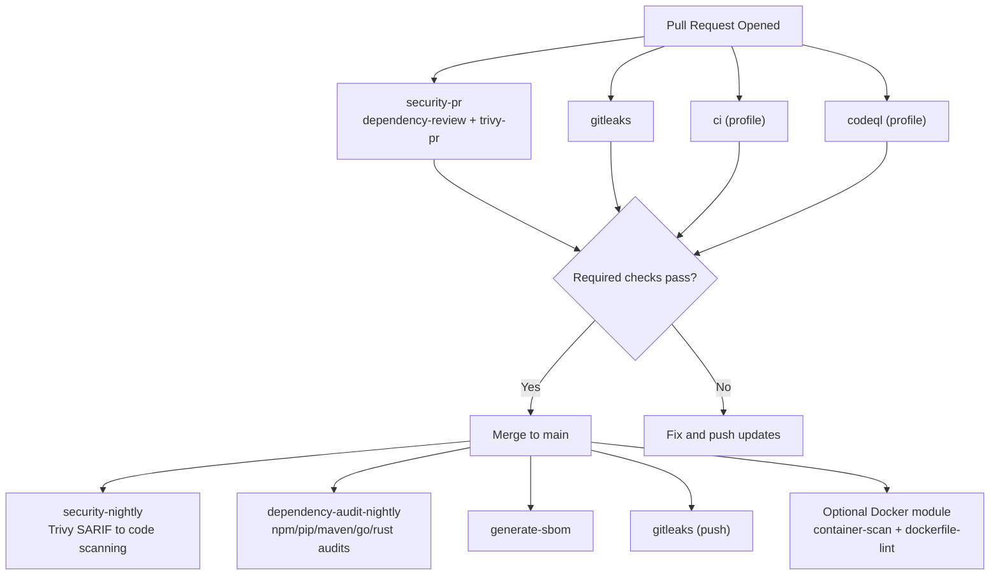

# Security Workflow Overview

## Notes
- `security-pr` runs on PR to block high-risk dependencies and filesystem vulnerabilities before merge.
- `security-nightly` and `dependency-audit-nightly` continue scanning after merge for drift and newly disclosed CVEs.
- If Docker mode is enabled, include `container-scan` and `dockerfile-lint` in required checks.
